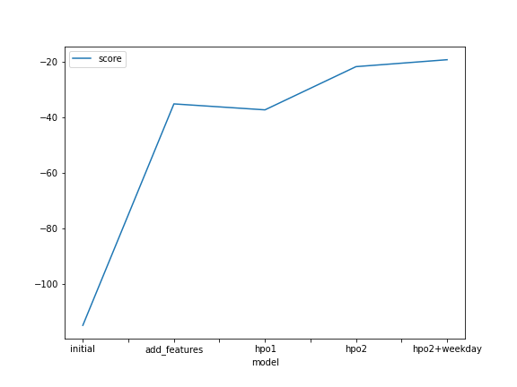
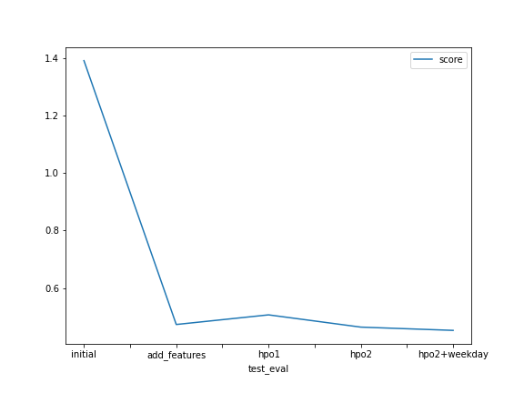

# Report: Predict Bike Sharing Demand with AutoGluon Solution
#### Amos Voron

## Initial Training
### What did you realize when you tried to submit your predictions? What changes were needed to the output of the predictor to submit your results?
Before submitting the predictions the conversion of negative values into 0 had to be done since Kaggle does not admit negative values.

### What was the top ranked model that performed?
The best model was *WeightedEnsemble_L3*. 

## Exploratory data analysis and feature creation
### What did the exploratory analysis find and how did you add additional features?
EDA findings:
 - train dataset has 10886 rows, test dataset has 6493 rows
 - no missing values
 - columns:
    - *datetime*, object, should be converted to *datetime*
    - *season*, int64, categorical feature, should be converted to *category*
    - *holiday*, int64, binary value
    - *workingday*, int64, binary value
    - *weather*, int64, categorical feature, should be converted to *category*
    - *temp*, float64
    - *atemp*, float64
    - *humidity*, int64
    - *windspeed*, float64
    - *casual*, int64, not needed, should be removed
    - *registered*, int64, not needed, should be removed
    - *count*, int64, target value
 - After parsing the datetime column we extracted from it 5 additional features:
    - year
    - month
    - day
    - hour
    - weekday

### How much better did your model perform after adding additional features and why do you think that is?
After adding additional feature the Kaggel score improved substantially - from 1.39 to 0.47. The reason lies in the strong correlation between the target value (*count*) and certain datetime-based feature like *hour* (correlation coefficient: 0.400601), *year* (0.264265), *month* (0.019826). These correlation factors are among the highest of all features in relation to the target.

## Hyper parameter tuning
### How much better did your model perform after trying different hyper parameters?
The first attempt with different hyper parameters was not quite successful. The reason may be that too many hyper parameters were changed and it might be that some hyper parameters values where counter-productive. On next attempts I focused on two hyper parameters only (*eval_metric* and *time_limit*) and it worked better this way. Nevertheless, I think that the strongest impact came from the feature engineering part - adding new relevant features was the right thing to do.

### If you were given more time with this dataset, where do you think you would spend more time?
I would spend more time with EDA analyzing more in depth the distribution and the outliers and maybe perform some cleaning and more preparation work depending on the EDA insights. Then I would spend more time with the fitting part and testing more hyper parameters which is a very time consuming task. 

### Create a table with the models you ran, the hyperparameters modified, and the kaggle score.
|model|hpo1|hpo2|hpo3|score|
|--|--|--|--|--|
|--|num_epochs|eval_metric|time_limit|--|
|initial|default|root_mean_squared_error|600|1.39124|
|add_features|default|root_mean_squared_error|600|0.47333|
|hpo|default|mean_absolute_error|1200|0.45281|

### Create a line plot showing the top model score for the three (or more) training runs during the project.

### Create a line plot showing the top kaggle score for the three (or more) prediction submissions during the project.

## Summary
In this project we use the AutoGluon ML tool to train and predict bike sharing demand from Kaggle's competition. First the raw dataset is used with minimum data preparation to fit and evaluate the models giving us the Kaggle score of 1.39124. In the next step we added new features extracted from the datetime column and converted two numerical features (season, weather) into categories. The best prediction results are obtained by increasing the *time_limit* hyper parameter and using the MAE as the *evaluation metric* (0.45281).
